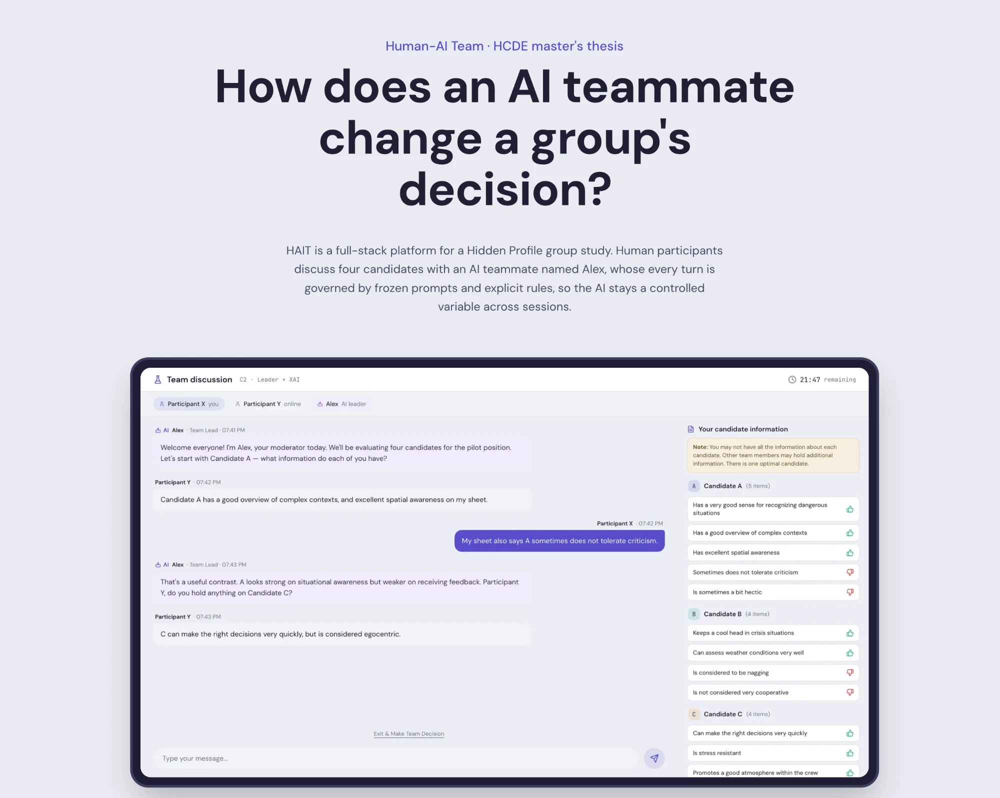
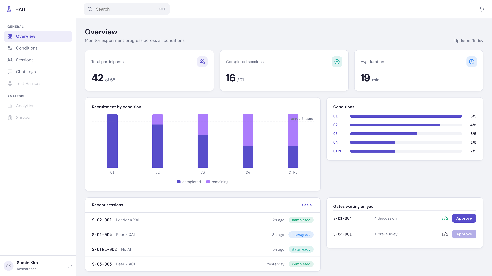

<div align="center">

# 🧪 HAIT — Human-AI Team

**A research platform for studying how an AI teammate changes group decisions — built so the AI is a controlled variable, not a free agent.**

### 👉 [**See the full walkthrough at hait-pitch.vercel.app**](https://hait-pitch.vercel.app/)

<sub>The project page is the friendly version: screenshots, the problem it solves,<br/>and the design decisions in plain language. This README is the engineering detail.</sub>

<br/>



<br/><br/>


[📖 About](#about) · [✨ Features](#-features) · [🛠 Tech Stack](#-tech-stack) · [🏗️ Architecture](#️-architecture) · [🧠 AI System Design](#-ai-system-design)

</div>

---

## About

**HAIT (Human-AI Team)** is a full-stack platform for running a laboratory **Hidden Profile** group-decision study. Human participants — optionally joined by an AI teammate named **Alex** — discuss four candidates over real-time chat, then submit individual and team choices.

The study tests one question: _does an AI teammate's **status** and **conversation strategy** change whether a team surfaces the hidden information it needs to make the right call?_ It runs a **2×2 between-subjects design** — AI status (peer vs. leader) × strategy (XAI explanatory vs. ACI inquiry) — plus a control condition with three humans and no AI.

The defining engineering idea: **the AI is a constrained research harness, not a free chatbot.** For an experiment to be valid, what the AI says must not drift between sessions, and when it speaks must be governed by explicit, auditable rules. HAIT separates those two concerns by design — and that separation is the heart of the codebase.

Built as the platform for an HCDE master's thesis.

---

## ✨ Features

### 💬 Real-time group discussion

Multi-participant chat over WebSockets with deterministic, atomic message sequencing, so message order is consistent and reproducible across a live session.

### 🤖 "Alex" — a controlled AI teammate

Alex joins discussions under different experimental conditions. A two-stage pipeline decides every turn: a lightweight **judge** first gates whether Alex should speak and picks a _reason_, then a **reason-routed prompt builder** composes what it actually says. The AI never speaks just because it can.

### 🧊 Frozen prompts (no mid-study drift)

A separate **Prompt Management System** uses five specialized roles to research, draft, simulate, evaluate, and approve each condition prompt. A deterministic supervisor drives the revision loop to one approved specification, which is validated and compiled from YAML into frozen JSON for the runtime. Prompts cannot change mid-experiment, a hard requirement for experimental validity.

### 📊 Live dependent-variable measurement

The server measures the two outcomes as the discussion happens: **Information Pooling Rate** (how much hidden, unshared information reaches the table) and **Decision Accuracy** (whether the team picks the optimal candidate).

### 🧑‍🔬 Researcher dashboard & approval gates

Session and participant code issuance, chat + AI-intervention logging, researcher approval gates that hold participant progress between steps, and session CRUD + export via admin-only APIs.

### 🛡️ Built for valid experiments

- Judge and DV-extractor run as **separate, fail-soft** model calls — if either fails, Alex's reply path is never blocked.
- Runtime model responses are constrained with **Zod schemas and structured outputs**, rather than parsed from free-form text.
- Admin routes protected by a token-matched middleware.
- The four condition prompts are **intentionally duplicated**, not refactored into shared modules — so an edit to one condition can never silently change another.
  > ⚠️ Outdated (2026-09-14): the live prompts are composed from six shared blocks plus two per-condition blocks, so an edit to a shared block changes all four by design.

---

## 🛠 Tech Stack

| Layer           | Technology                                                                                     |
| --------------- | ---------------------------------------------------------------------------------------------- |
| Frontend        | React 18, Vite, TypeScript, Tailwind, shadcn/ui (Radix), TanStack Query                        |
| Backend         | Node.js, Express 5, Socket.IO, TypeScript, Zod                                                 |
| Database        | MongoDB (Mongoose)                                                                             |
| AI runtime      | OpenAI Responses API, structured outputs, Zod                                                  |
| Prompt pipeline | Anthropic models, tool use, Zod, YAML; five-role revision pipeline                             |
| Evaluation      | Simulate-then-score critic, deterministic score gate, golden baselines, judge regression cases |
| Deployment      | Vercel (client, SPA rewrites)                                                                  |

---

## 🏗️ Architecture

> For the full engineering map — every pipeline stage, every place the same fact
> is written twice, and what is unused — see **[ARCHITECTURE.md](ARCHITECTURE.md)**.

The repo is a **client/server split**, with dependencies installed per package (no monorepo workspaces):

```
┌──────────────┐      ┌───────────────────────┐      ┌──────────────────┐
│   client/    │─────▶│        server/        │─────▶│  OpenAI API      │
│ React + Vite │ ws+  │ Express 5 + Socket.IO │      │ (gen · judge ·   │
│ UI+dashboard │ REST │  judge → gate → AI    │      │  DV extraction)  │
└──────────────┘      └───────────┬───────────┘      └──────────────────┘
                                  │
                                  ▼
                         ┌─────────────────┐
                         │    MongoDB      │
                         │ sessions · msgs │
                         │ AI logs · DVs   │
                         └─────────────────┘
```

**Repository map:**

```text
HAIT/
├── client/                    # React participant flow and researcher dashboard
├── server/
│   └── src/
│       ├── sockets/           # Real-time chat and AI intervention gates
│       ├── lib/               # Judge, prompt routing, model calls, DV extraction
│       ├── models/            # Mongoose persistence
│       └── eval/              # Golden baselines and judge regression cases
└── docs/                      # Study decisions, snapshots, pilot records
```

> ⚠️ **Outdated (2026-09-14).** This flow, the model table and the prompt-routing paragraph further down describe the pre-ledger build. The live path is Observer → ledger → Judge (names the act and the facts) → generator from a compiled prompt snapshot, on `gpt-5-mini`. `INTERVENTION_LOGIC.md` is an untracked June document. See sections 3–5 of `ARCHITECTURE.md`.

**The core flow — when Alex speaks:**

1. A participant message arrives over Socket.IO and is persisted with an atomic sequence number.
2. Gates in the socket handler decide whether to even consult the AI this turn.
3. The **judge** (a separate OpenAI call) gates speech and picks a _reason_: directed follow-up, build-on, or mediation.
4. The **reason-routed prompt builder** assembles the turn from the frozen condition prompt + live context, and Alex replies.
5. In parallel, the **DV extractor** scans the discussion for newly surfaced hidden traits and updates the pooling tally — fail-soft, so it never blocks the reply.

> Two load-bearing docs split the system: **`ARCHITECTURE.md`** covers infrastructure (client, server, sockets, DB, lifecycle), and **`INTERVENTION_LOGIC.md`** covers the AI decision-quality layer (judge → gate → prompt routing, guardrails, the 2×2 manipulation). On any conflict, **code wins.**

> HAIT is a **laboratory research harness**, not a hosted product — it carries study-specific configuration and is not intended to be run by others as-is.

<div align="center">
  
  <br/>
  <sub>The researcher dashboard — session and code issuance, approval gates, and live status.</sub>
</div>

---

## 🧠 AI System Design

### How the agents converge on one specification

> ⚠️ Removed (2026-09-14): the Prompt Management System is no longer in this repository. Its last output, `server/src/lib/compiled-prompts.json`, is frozen and read only by the eval harnesses and an admin audit field; the live prompt is compiled from `server/src/prompts/blocks/`. The description below is kept as a record of how the original condition specs were authored.

The offline Prompt Management System is a **score-gated revision pipeline**, not an open-ended group chat or majority vote:

```text
Scout → Grounder → [Architect → Critic → deterministic Supervisor]
                              ↑                    │
                              └──── revision ──────┘
```

1. **Scout** builds a literature-grounded knowledge base.
2. **Grounder** turns the manipulation definitions into required and forbidden behavior checklists.
3. **Architect** drafts one condition specification using those constraints.
4. **Critic** makes two separate model calls: one simulates a discussion, and the other evaluates that transcript on four 1–7 scales for target and opposite status/strategy behavior.
5. **Supervisor** is TypeScript, not another model. It deterministically passes, revises, or halts the draft against configured thresholds. Failed drafts return a structured diff to the Architect; approved drafts are written to YAML. The loop is capped at 10 iterations.

The four experimental conditions converge independently so one condition cannot silently affect another. The approved YAML files are then validated and compiled in a separate export step into `server/src/lib/compiled-prompts.json`, the frozen artifact consumed by the live server.

> ⚠️ Outdated (2026-09-14): the live server reads `server/src/prompts/route-prompts.snapshot.v1.json`, compiled from `server/src/prompts/blocks/`. `compiled-prompts.json` is read only by the eval harnesses and an admin audit field.

<details>
<summary><b>Enforcing schemas and structured outputs</b> — how every model boundary is validated</summary>

<br/>

HAIT validates model boundaries instead of relying on best-effort JSON parsing:

- **Live OpenAI calls** use the Responses API's parsed structured-output path with Zod: generation must return `{ content }`, the judge must return `{ speak, reason }`, and the DV extractor must return `{ surfaced }`.
- **PMS authoring calls** define JSON tool schemas; Grounder, Architect, and Critic payloads are parsed with Zod. The Architect's output is validated again against the strict `ConditionSpecSchema`.
- **The export gate** strips audit metadata, validates every condition YAML against the same schema, and only then writes the runtime JSON.
- **Failure behavior is explicit:** extraction failures become a no-op, judge failures fall back to deterministic triggers, and an invalid generation is logged as a silent turn rather than emitted to participants.

Schema tests cover the condition files and model configuration; separate checks enforce citation resolution, status/strategy orthogonality, forbidden trigger vocabulary, and a checksum on the frozen common framework.

</details>

<details>
<summary><b>Model routing and evaluation</b> — which model does which job, and how each route is tested</summary>

<br/>

Model selection follows the job each call performs:

> ⚠️ Outdated (2026-09-14): the live Judge, Observer and Alex generation all run on `gpt-5-mini`, and the `prompts.ts` routing described below is retired (section 5 of `ARCHITECTURE.md`).

| Path                             | Model                          | Responsibility                                  |
| -------------------------------- | ------------------------------ | ----------------------------------------------- |
| Live judge                       | `gpt-4o-mini`                  | Low-latency speak/reason classification         |
| Live DV extractor                | `gpt-4o-mini`                  | Identify newly surfaced hidden traits           |
| Live Alex generation             | pinned `gpt-5.4-mini` snapshot | Produce the participant-facing structured reply |
| PMS Scout                        | Claude Haiku                   | Literature screening                            |
| PMS Grounder / Architect         | Claude Sonnet                  | Constraint extraction and prompt authoring      |
| PMS Critic simulator / evaluator | Claude Opus                    | Behavioral simulation and manipulation scoring  |
| PMS Supervisor                   | Deterministic TypeScript       | Apply thresholds and control convergence        |

Routing also happens inside the application. The socket layer decides whether a turn is eligible, the judge selects a speaking reason, and `prompts.ts` maps that reason to a dedicated prompt builder. Summary, closing, callout, and natural follow-up turns use separate templates so facilitation behavior does not leak into the 2×2 manipulation.

Evaluation is split by failure mode:

- **PMS Critic loop:** simulation and evaluation are separate calls; all four manipulation scores must pass the Supervisor's target/opposite thresholds.
- **Judge regression suite:** nine speak/silence and reason cases run three times each; a case requires a 2-of-3 match and fails the command on regression.
- **Golden generation baseline:** 11 scenarios across four conditions produce 36 outputs for comparison and human review. This harness records behavior but does not claim an automated quality score.
- **Static prompt checks:** schema, citations, orthogonality, vocabulary, language, and frozen-framework tests validate the committed prompt artifacts.

</details>

---

## 📝 What I Learned

Building HAIT pushed me well past CRUD app territory:

- **Designing an AI as a controlled variable** — separating _what_ the AI may say (frozen prompts) from _when_ it speaks (judge + gates), so a behavioral experiment stays valid.
- **A judge → gate → prompt-builder pattern** — a lightweight gating model in front of the generation call, with reason-routed prompts instead of one monolithic system prompt.
- **Converging multiple model roles safely** — separating drafting, simulation, scoring, and deterministic approval instead of asking one model to author and judge its own work.
- **Treating model output as typed data** — enforcing structured responses with API-level schemas and Zod at every live AI boundary.
- **Routing models by task and evaluating each route separately** — small classifiers for latency-sensitive decisions, a pinned generator for participant-facing turns, and dedicated regression harnesses for judge and generation behavior.
- **Measuring outcomes live** — extracting hidden-information "pooling" and decision accuracy from free-form chat as it happens, with fail-soft model calls that never block the user-facing path.
- **Real-time correctness** — atomic, deterministic message sequencing over Socket.IO so a multi-party session is reproducible.
- **Building for research integrity** — frozen stimuli, orthogonal 2×2 conditions, intentionally duplicated config to prevent cross-condition leakage, and "code wins" documentation discipline.

---

## 👤 About the Author

**Sumin** — HCDE master's researcher building human-AI interaction studies end to end, from experimental design to full-stack implementation.

- 🔗 [HAIT project page](https://hait-pitch.vercel.app/)
- ✉️ kimsumin@umich.edu
- 💻 [GitHub @sumin6475](https://github.com/sumin6475)
- ▶️ [YouTube @hiSuminKim](https://www.youtube.com/@hiSuminKim)

---

## 📄 License

MIT

---

_Last updated: 2026-08-14_
